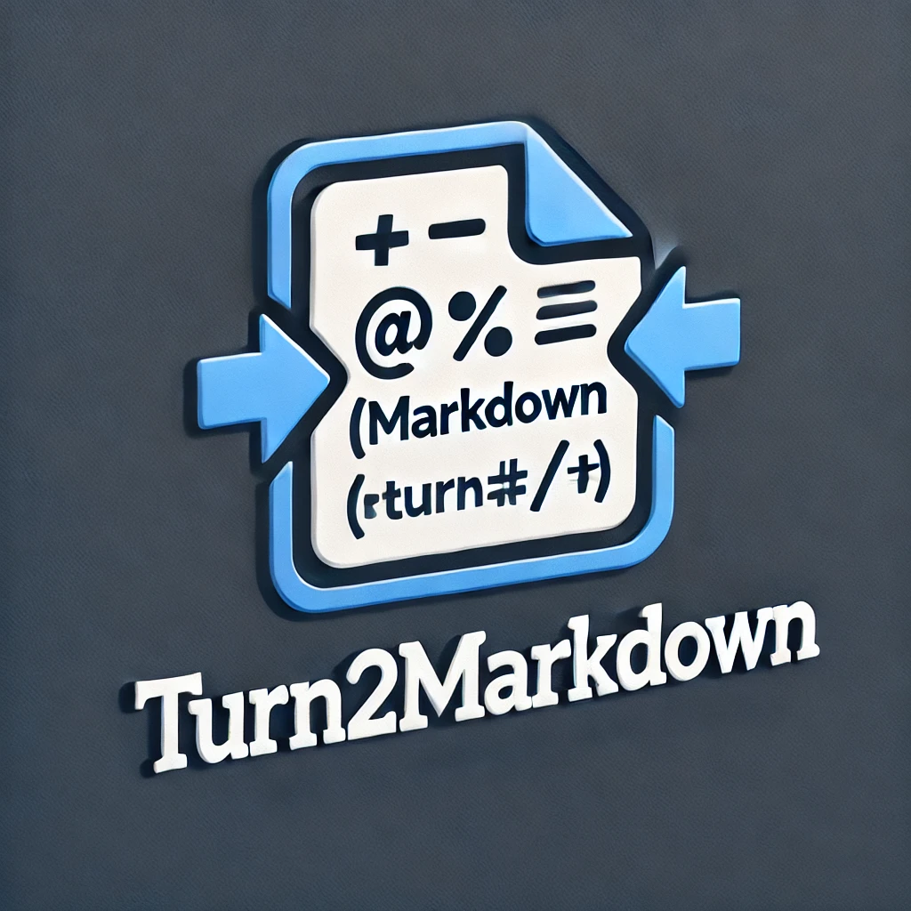

# Turn2Markdown

<p align="center">
  
</p>

<div align="center">

[](https://github.com/SeimoDev/Turn2Markdown-Server)
[](LICENSE)

[English](#english) | [简体中文](#简体中文)

[Fronted | 前端](https://github.com/SeimoDev/Turn2Markdown)

</div>

## Description

This project is a FastAPI application that allows users to upload files, convert them using MarkItDown, and download the converted files. The application also includes a feature to automatically delete uploaded and converted files after 10 minutes.

## Features

- Upload files
- Convert files using MarkItDown
- Download converted files
- Automatically delete files after 10 minutes
- CORS support

## Installation

1. Clone the repository:
    ```sh
    git clone https://github.com/SeimoDev/Turn2Markdown-Server.git
    cd Turn2Markdown-Server
    ```

2. Create a virtual environment and activate it:
    ```sh
    python -m venv venv
    source venv/bin/activate  # On Windows use `venv\Scripts\activate`
    ```

3. Install the dependencies:
    ```sh
    pip install -r requirements.txt
    ```

## Usage

1. Run the FastAPI application:
    ```sh
    uvicorn main:app --reload
    ```

2. Open your browser and navigate to `http://127.0.0.1:8000/docs` to access the API documentation.

## License

This project is licensed under the GPL v3 License. See the [LICENSE](LICENSE) file for more details.

---

## 描述

该项目是一个FastAPI应用程序，允许用户上传文件，使用MarkItDown进行转换，并下载转换后的文件。该应用程序还包括一个功能，可以在10分钟后自动删除上传和转换的文件。

## 功能

- 上传文件
- 使用MarkItDown转换文件
- 下载转换后的文件
- 10分钟后自动删除文件
- 支持CORS

## 安装

1. 克隆仓库：
    ```sh
    git clone git clone https://github.com/SeimoDev/Turn2Markdown-Server.git

    cd Turn2Markdown-Server
    ```

2. 创建虚拟环境并激活：
    ```sh
    python -m venv venv
    source venv/bin/activate  # 在Windows上使用 `venv\Scripts\activate`
    ```

3. 安装依赖：
    ```sh
    pip install -r requirements.txt
    ```

## 使用

1. 运行FastAPI应用程序：
    ```sh
    uvicorn main:app --reload
    ```

2. 打开浏览器并导航到 `http://127.0.0.1:8000/docs` 以访问API文档。

## 许可证

该项目使用GPL v3许可证。有关更多详细信息，请参阅[LICENSE](LICENSE)文件。